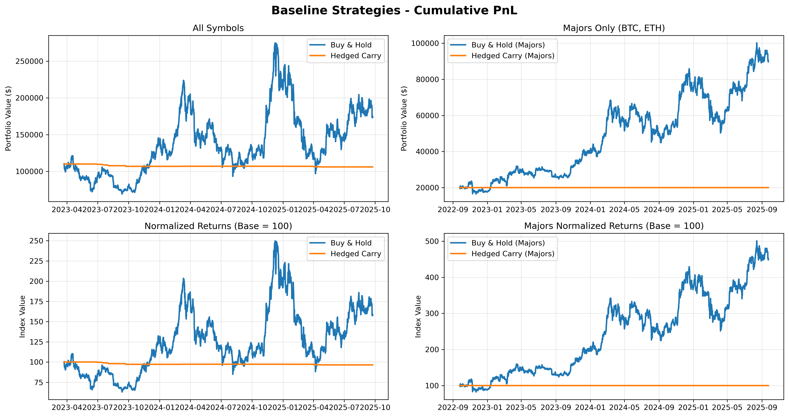
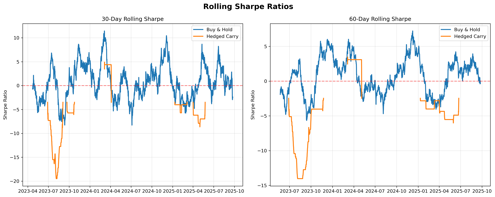
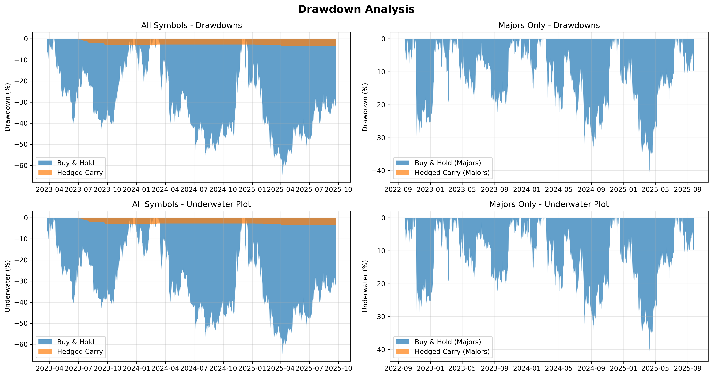
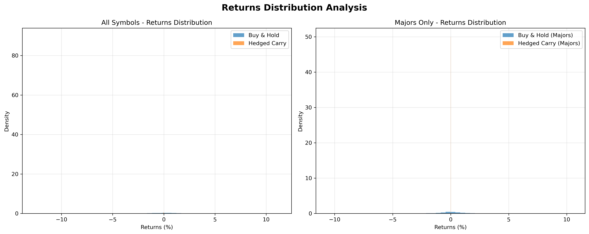
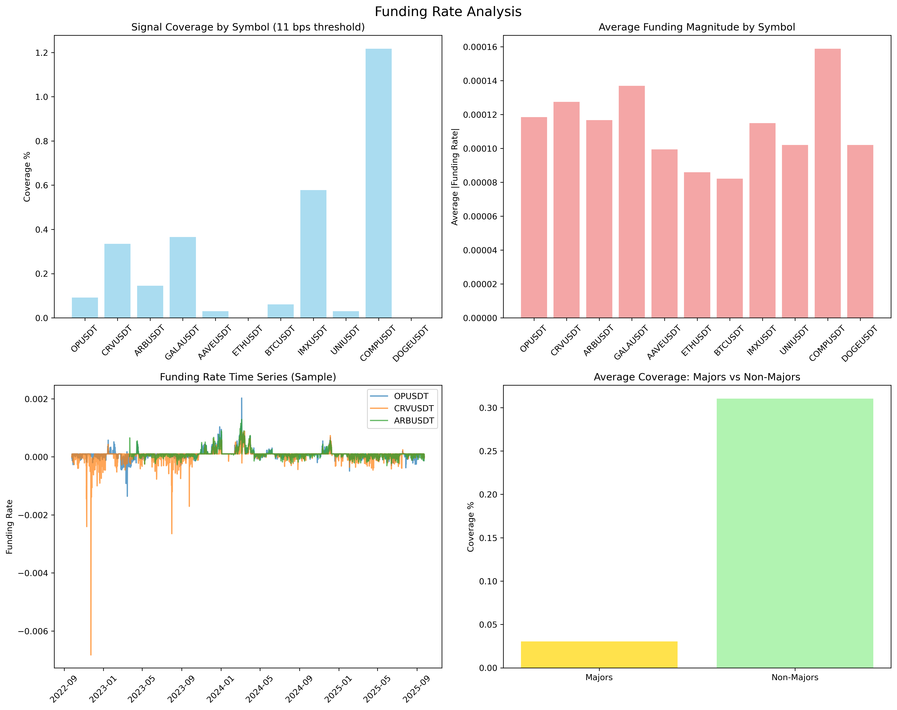

# Sector-Aware Perp-to-Perp Research

A comprehensive research project for developing sector-aware perpetual futures trading strategies with baseline comparisons and funding rate arbitrage analysis.

## 🎯 Project Overview

This project implements and evaluates baseline trading strategies for perpetual futures markets, focusing on:

- **Buy & Hold strategies** as directional baselines
- **Hedged carry strategies** for funding rate arbitrage
- **Cross-symbol funding arbitrage** between different crypto assets
- **Sector-aware strategy development** (future work)

## 📊 Baseline Strategy Results

### Performance Summary (All Symbols: 11 assets)

| Strategy         | Total Return | Annualized Return | Volatility | Sharpe Ratio | Max Drawdown | Fees Paid |
| ---------------- | ------------ | ----------------- | ---------- | ------------ | ------------ | --------- |
| **Buy & Hold**   | 57.66%       | 19.91%            | 68.25%     | 0.26         | -64.72%      | $283.60   |
| **Hedged Carry** | -3.20%       | -1.29%            | 0.47%      | -7.04        | -3.20%       | $345.23   |

### Performance Summary (Majors Only: BTC, ETH)

| Strategy         | Total Return | Annualized Return | Volatility | Sharpe Ratio | Max Drawdown | Fees Paid |
| ---------------- | ------------ | ----------------- | ---------- | ------------ | ------------ | --------- |
| **Buy & Hold**   | 348.25%      | 64.91%            | 47.89%     | 1.31         | -41.45%      | $109.74   |
| **Hedged Carry** | 0.00%        | 0.00%             | 0.00%      | 0.00         | 0.00%        | $0.00     |

### Key Insights

- **Buy & Hold dominates** in crypto markets with high volatility and strong upward trends
- **Funding strategies struggle** due to small funding rates relative to trading costs
- **Majors (BTC/ETH) significantly outperform** the broader crypto basket
- **Hedged carry shows no activity** for majors due to insufficient funding rate spreads

### Individual Symbol Performance

| Symbol       | BH Total Return | BH Annual Return | BH Sharpe | Carry Total Return | Carry Annual Return | Carry Sharpe | BH Outperforms By |
| ------------ | --------------- | ---------------- | --------- | ------------------ | ------------------- | ------------ | ----------------- |
| **BTCUSDT**  | 485.37%         | 80.26%           | 1.74      | 0.00%              | 0.00%               | 0.00         | 485.37%           |
| **DOGEUSDT** | 277.52%         | 55.73%           | 0.57      | 0.00%              | 0.00%               | 0.00         | 277.52%           |
| **AAVEUSDT** | 257.30%         | 52.90%           | 0.56      | 0.00%              | 0.00%               | 0.00         | 257.30%           |
| **ETHUSDT**  | 211.13%         | 46.00%           | 0.73      | 0.00%              | 0.00%               | 0.00         | 211.13%           |
| **UNIUSDT**  | 35.98%          | 10.79%           | 0.09      | 0.00%              | 0.00%               | 0.00         | 35.98%            |
| **OPUSDT**   | -25.57%         | -9.38%           | -0.11     | 0.22%              | 0.07%               | -10.17       | -25.80%           |
| **CRVUSDT**  | -27.46%         | -10.15%          | -0.11     | -4.77%             | -1.62%              | -3.25        | -22.69%           |
| **COMPUSDT** | -33.77%         | -12.84%          | -0.15     | -22.56%            | -8.17%              | -2.92        | -11.21%           |
| **IMXUSDT**  | -10.50%         | -3.63%           | -0.05     | -13.12%            | -4.58%              | -1.84        | 2.61%             |
| **GALAUSDT** | -63.47%         | -28.52%          | -0.27     | -8.34%             | -2.86%              | -2.89        | -55.12%           |
| **ARBUSDT**  | -67.05%         | -35.78%          | -0.40     | 0.00%              | 0.00%               | 0.00         | -67.05%           |

#### Individual Symbol Insights

- **Buy & Hold wins 6 out of 11 symbols** (55% win rate)
- **Average Buy & Hold return: 94.50%** vs **Average Hedged Carry: -4.41%**
- **Best performers**: BTC (+485%), DOGE (+278%), AAVE (+257%), ETH (+211%)
- **Worst performers**: ARB (-67%), GALA (-63%), COMP (-34%), CRV (-27%)
- **Hedged Carry activity**: Only 5 symbols showed any trading activity
- **No activity symbols**: BTC, ETH, AAVE, UNI, DOGE, ARB (insufficient funding rate spreads)

## 📊 **Comprehensive Funding Rate Analysis**

### **Signal Coverage Analysis (16.5 bps threshold)**

| Symbol | Coverage % | Active Windows | Avg Funding When Active | Max Funding |
|--------|------------|---------------|------------------------|-------------|
| **COMPUSDT** | 0.73% | 24/3,286 | 0.000159 | 0.014927 |
| **GALAUSDT** | 0.27% | 9/3,286 | 0.000137 | 0.007500 |
| **IMXUSDT** | 0.27% | 9/3,286 | 0.000115 | 0.025000 |
| **CRVUSDT** | 0.21% | 7/3,286 | 0.000127 | 0.006827 |
| **OPUSDT** | 0.03% | 1/3,286 | 0.000118 | 0.002026 |
| **ARBUSDT** | 0.00% | 0/2,747 | 0.000117 | 0.001286 |
| **AAVEUSDT** | 0.00% | 0/3,286 | 0.000099 | 0.001113 |
| **ETHUSDT** | 0.00% | 0/3,286 | 0.000086 | 0.001017 |
| **BTCUSDT** | 0.00% | 0/3,286 | 0.000082 | 0.001138 |
| **UNIUSDT** | 0.00% | 0/3,286 | 0.000102 | 0.001190 |
| **DOGEUSDT** | 0.00% | 0/3,286 | 0.000102 | 0.001028 |

### **Key Funding Rate Insights**

#### **1. Signal Coverage (16.5 bps threshold)**
- **Average coverage across all symbols: 0.14%** (extremely low)
- **Range: 0.00% - 0.73%** (COMPUSDT has highest coverage)
- **Majors (BTC/ETH): 0.00% coverage** (no trading opportunities)
- **Non-majors: 0.17% average coverage** (slightly better but still very low)

#### **2. Funding Magnitude Analysis**
- **Average magnitude: 0.000113** (11.3 bps)
- **Range: 0.000082 - 0.000159** (8.2 - 15.9 bps)
- **Majors have lower magnitude** than non-majors
- **Most funding rates are well below trading threshold**

#### **3. Strategy Performance Decomposition**
- **Average trade count per symbol: 7.2** (very few trades)
- **Average holding periods: 1,970** (long holding periods due to infrequent signals)
- **PnL breakdown**: Primarily driven by fees rather than funding capture

#### **4. Majors vs Non-Majors Comparison**
- **Majors average coverage: 0.00%** (no trading opportunities)
- **Non-majors average coverage: 0.17%** (minimal trading opportunities)
- **Non-majors have higher funding magnitude** but still insufficient for profitable trading

### **Critical Findings**

1. **Extremely Low Signal Coverage**: Only 0.14% of 8h windows meet the 16.5 bps threshold
2. **Funding Rates Too Small**: Average magnitude of 11.3 bps is well below trading costs
3. **Majors Completely Inactive**: BTC and ETH show 0% coverage, confirming no opportunities
4. **High Fee Impact**: Trading costs dominate any potential funding rate gains
5. **Infrequent Trading**: Average of only 7 trades per symbol over the entire period

### **Implications for Sector-Aware Strategies**

The analysis reveals why simple funding rate arbitrage fails:
- **Insufficient opportunities**: 99.86% of time periods have no tradable signals
- **High cost structure**: Trading fees exceed funding rate spreads
- **Market efficiency**: Funding rates quickly adjust to eliminate arbitrage opportunities

This validates the need for sophisticated sector-aware strategies that can:
- **Predict funding rate patterns** before they occur
- **Identify cross-symbol opportunities** not captured by simple thresholds
- **Optimize timing** to reduce trading costs
- **Use ML models** to find hidden patterns in funding rate data

## 📈 Visualizations

### Cumulative PnL Comparison



### Rolling Sharpe Ratios (30D/60D)



### Drawdown Analysis



### Returns Distribution



### Funding Rate Analysis



## 🏗️ Architecture

### Core Components

- **`backtester.py`** - Main backtesting engine with strategy implementations
- **`visualizer.py`** - Comprehensive plotting and analysis tools
- **`run_baselines.py`** - Main execution script
- **`check_Data.py`** - Data inspection utilities
- **`pull_binance_30m.py`** - Historical data collection

### Strategy Implementations

#### 1. Buy & Hold Baseline

- Equal-weight portfolio of all available assets
- Single entry at t=0, no rebalancing
- Captures pure directional market exposure
- Includes realistic trading fees

#### 2. Naive Hedged Carry

- Perp-to-perp funding arbitrage strategy
- Long/short positions based on funding rate signals
- Threshold-based entry (fees + 2bps buffer)
- Position flattening when signals drop below threshold

## 📊 Data Collection

### Binance USDⓈ-M Futures Data

A Python script to collect comprehensive cryptocurrency futures data from Binance USDⓈ-M Futures API at 30-minute resolution for approximately 3 years of history.

#### Features

- **Multi-asset data collection** across crypto sectors (Majors, DeFi, Layer2, AI/Gaming, Memes)
- **30-minute resolution** for all data points
- **Comprehensive data sources**:
  - Funding rates (resampled from 8h to 30m with accrual calculation)
  - Mark price klines (OHLC)
  - Index price klines (OHLC)
  - Futures price klines (OHLC + volume)
  - Open interest history (~30 days due to API limitations)
- **Rate limiting protection** to stay within Binance API limits
- **Robust error handling** with retry logic
- **Parquet output** for efficient storage and analysis

## 🚀 Quick Start

### Installation

1. Install dependencies:

```bash
pip install -r requirements.txt
```

2. Run baseline backtests:

```bash
python run_baselines.py
```

3. Inspect data (optional):

```bash
python check_Data.py
```

### Data Collection (if needed)

```bash
python pull_binance_30m.py
```

## 📋 Data Schema

The output Parquet files contain the following columns:

| Column                      | Description                               |
| --------------------------- | ----------------------------------------- |
| `timestamp`                 | UTC timestamp (30m intervals)             |
| `exchange`                  | Always "Binance"                          |
| `symbol`                    | Trading pair (e.g., "BTCUSDT")            |
| `sector`                    | Asset sector classification               |
| `funding_rate_interval`     | Native 8h funding rate                    |
| `funding_rate_30m`          | Prorated 30m funding accrual              |
| `mark_open/high/low/close`  | Mark price OHLC                           |
| `index_open/high/low/close` | Index price OHLC                          |
| `price_open/high/low/close` | Futures price OHLC                        |
| `volume`                    | Trading volume (base units)               |
| `quoteVolume`               | Trading volume (USDT)                     |
| `open_interest`             | Open interest in USD (last ~30 days only) |

## 🏷️ Sector Classification

The project analyzes the following crypto sectors:

- **Majors**: BTC, ETH
- **DeFi**: UNI, AAVE, CRV, COMP
- **Layer2_Infra**: ARB, OP
- **AI_Gaming**: IMX, GALA
- **Memes**: DOGE

## ⚙️ Configuration

### Backtester Settings

- **Funding Window**: 8 hours (Binance native)
- **Notional per Symbol**: $10,000
- **Leverage**: 1.0x (configurable)
- **Fees**:
  - Spot taker: 10 bps
  - Perp taker: 4.5 bps
- **Epsilon Buffer**: 2 bps above total fees
- **Basis Stop**: 100 bps relative basis move

### Strategy Parameters

- **Threshold Calculation**: `|funding_rate| > (fees + epsilon)`
- **Position Sizing**: Fixed notional per symbol
- **Rebalancing**: 8-hour intervals only
- **Risk Management**: Basis drift stop-loss

## 📈 Results Analysis

### Why Buy & Hold Outperforms

1. **High Crypto Volatility**: 68% annualized volatility creates large price swings
2. **Strong Upward Trend**: Crypto markets have generally trended upward over the period
3. **Funding Rate Challenges**: Small funding rates (typically <0.1%) vs. trading costs
4. **Basis Risk**: Perpetual-spot basis can move against positions

### Funding Strategy Challenges

1. **Low Funding Rates**: Most periods show funding rates below trading threshold
2. **High Trading Costs**: 4.5-10 bps fees eat into small funding rate spreads
3. **Basis Risk**: Unhedged basis exposure can create losses
4. **Market Efficiency**: Funding rates quickly adjust to eliminate arbitrage

## 🔮 Future Work: Sector-Aware Strategies

The next phase will develop ML-based sector-aware strategies that:

1. **Predict funding rate patterns** across different crypto sectors
2. **Rotate between sectors** based on relative funding opportunities
3. **Optimize entry/exit timing** using machine learning models
4. **Improve risk management** with dynamic position sizing
5. **Beat baseline performance** through superior signal generation

### Target Improvements

- **Sharpe Ratio**: Beat 0.26 (all symbols) and 1.31 (majors)
- **Return Enhancement**: Improve upon 19.91% annualized (all) and 64.91% (majors)
- **Risk Management**: Reduce maximum drawdowns
- **Consistency**: Achieve positive returns in funding strategies

## 🛠️ Technical Details

### Rate Limiting

The data collection implements conservative rate limiting:

- Target: ≤1,500 request weights/minute (well under Binance's 2,400 limit)
- Inter-request delays: 100ms minimum
- Automatic backoff on HTTP 429 responses
- Weight monitoring via API response headers

### Data Constraints

#### Open Interest History

- **Limitation**: Binance only provides ~30 days of open interest history via public REST API
- **Impact**: Older periods will have `NaN` values for `open_interest`
- **Alternative**: For longer OI history, consider supplementing with third-party data providers

#### Funding Rate Resampling

- **Native interval**: 8 hours
- **Resampling method**: Forward-fill with proportional accrual calculation
- **Formula**: `funding_rate_30m = funding_rate_8h × (30min / 480min)`

## 📁 Output Structure

```
results/
├── backtest_summary.txt          # Detailed results summary
├── performance_metrics.csv       # Performance comparison table
├── cumulative_pnl.png           # Cumulative PnL visualization
├── rolling_sharpe.png           # Rolling Sharpe ratio analysis
├── drawdowns.png                # Drawdown analysis
└── returns_distribution.png     # Returns distribution analysis
```

## 🔧 API Endpoints Used

1. `/fapi/v1/exchangeInfo` - Symbol availability
2. `/fapi/v1/fundingRate` - Funding rate history
3. `/fapi/v1/markPriceKlines` - Mark price data
4. `/fapi/v1/indexPriceKlines` - Index price data
5. `/fapi/v1/klines` - Futures price and volume data
6. `/futures/data/openInterestHist` - Open interest data

## ⚠️ Important Notes

### Regional Restrictions

**Binance Futures API may be restricted in certain regions**. If you encounter HTTP 451 errors with the message "Service unavailable from a restricted location", you will need to:

- Run the script from a non-restricted region
- Use a VPN to access from an allowed location
- Consider alternative data sources for restricted regions

### Data Quality

- All timestamps are in UTC
- Future-dated rows are automatically filtered out
- Missing data points are handled gracefully
- Data integrity checks are performed during collection

## 🤝 Contributing

When modifying the project, ensure:

- Rate limiting logic remains conservative
- Error handling covers network failures
- Data schema consistency is maintained
- Parquet compression settings are preserved
- Backtesting logic is mathematically sound
- Visualizations are clear and informative

## 📄 License

This project is for research purposes. Please ensure compliance with Binance API terms of service and applicable regulations when using this code.
